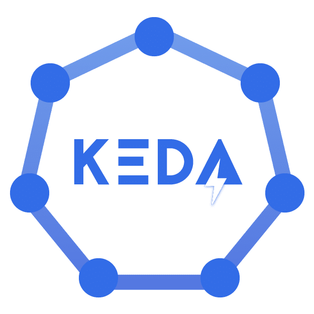
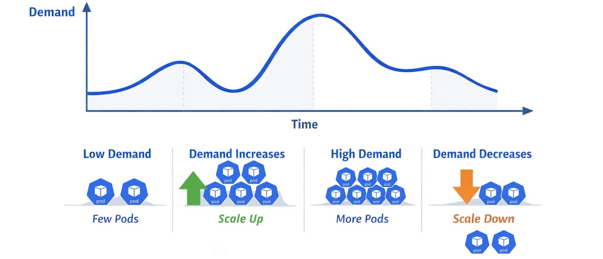
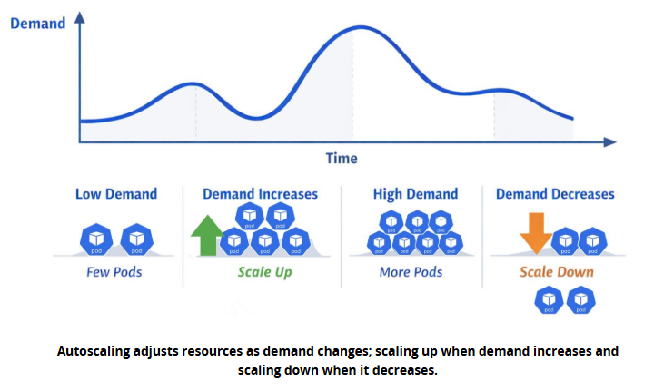
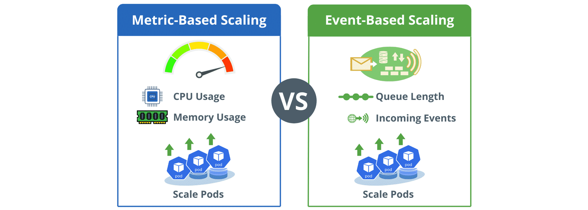

# Introduction to Kubernetes Event-Driven Autoscaling (KEDA)

## Section and SCORM overview

The portal syllabus labels this section **Introduction to Kubernetes Event-Driven Autoscaling (KEDA)**, with the source page **Exploring KEDA**. The embedded module is titled **Chapter 2. Introduction to KEDA**. Its cover says the chapter explains how KEDA extends Kubernetes autoscaling beyond traditional resource metrics; introduces autoscaling and Horizontal Pod Autoscaler (HPA) limitations; explains event-driven scaling; and ends with KEDA features, benefits, and a real-world example.

### Internal screens

The SCORM table of contents lists these screens in order:

1. Chapter 2 Overview
2. What Is KEDA?
3. What is Autoscaling?
4. Horizontal Pod Autoscaling (HPA)
5. The Need for KEDA
6. Comparison Between KEDA and HPA
7. Key Features and Benefits of KEDA
8. Applying KEDA in a Real-World Scenario

### Navigation and visual

The portal repeats the course navigation instructions: begin the lesson, use its menu, advance with the next-lesson control at the bottom of each page, and finish all content before using the gray next-section arrow. The cover repeats the KEDA/Kubernetes scaling illustration described in [Course Introduction](../01%20-%20Course%20Introduction/README.md#instructional-visual): a KEDA mark and Kubernetes symbol amid cloud imagery, opposing up/down arrows, and container-like shapes.

## Chapter 2 Overview

This screen frames KEDA as a way to scale containerized applications across cloud environments based on real-time events. It revisits Kubernetes HPA, asks learners to examine its limits and how KEDA extends it, and previews a real-world example of handling varying workloads.

By the end of the chapter, learners should be able to describe KEDA and its main features, identify HPA limitations, and distinguish KEDA's benefits over HPA. The screen is presented over a pale cloud-sky banner; it contains no instructional diagram beyond the banner and chapter heading. No video or audio is exposed on this screen.

## What Is KEDA?

Cloud-native workloads can change quickly, so systems need to respond efficiently to shifting demand. Kubernetes handles container orchestration, but additional tooling can be needed for automated scaling driven by events. KEDA (Kubernetes Event-Driven Autoscaling) is an open-source, CNCF-graduated project that extends Kubernetes so applications can scale on events such as message-queue depth, incoming HTTP requests, and custom-defined metrics.

KEDA acts as a bridge between Kubernetes workloads and external event sources, allowing scaling to follow real-time demand. The page emphasizes that KEDA is vendor-agnostic, so teams can use it with different cloud providers; it connects applications to event sources, may improve resource utilization, can reduce cost, and helps applications respond to changing demand. The page links to the [KEDA project](https://keda.sh/).

### Instructional visual and media

The screen shows the blue KEDA wordmark inside a six-node hexagonal ring, with a stylized lightning bolt in the letter A. A callout summarizes the idea: KEDA connects Kubernetes workloads to external events for more responsive scaling.

## What is Autoscaling?

Autoscaling means automatically adjusting a system's resources—such as compute, storage, or network bandwidth—to current workload or demand. In cloud and cloud-native systems, demand can shift quickly; adapting resources instead of keeping a fixed allocation helps maintain performance while avoiding unnecessary cost. In Kubernetes, the concept includes dynamically changing the number of running Pod instances based on resource usage and other metrics.

### Instructional diagram

The diagram plots **Demand** against **Time** with a wavy line moving through low demand, rising demand, a high-demand peak, and a later decrease. Four captions pair those phases with Pod icons: **Low Demand / Few Pods**, **Demand Increases / Scale Up**, **High Demand / More Pods**, and **Demand Decreases / Scale Down**. Up and down arrows emphasize adding and removing Pods. The lesson caption states that resources scale up when demand increases and scale down when it decreases; the adjacent prose explains that autoscaling helps systems stay flexible, efficient, and resilient. The original SCORM asset is embedded below.

The earlier screenshot crop preserves the diagram and its on-page caption as it appeared in the lesson.

The page also repeats the prior KEDA callout that connecting Kubernetes workloads to external events enables more responsive scaling. No video or audio is exposed.

## Horizontal Pod Autoscaling (HPA)

Kubernetes HPA is an API resource and controller in API version `autoscaling/v2`. It scales workloads such as Deployments and StatefulSets by changing the number of running Pods to match observed demand. Horizontal scaling means adding or removing Pods as load changes: HPA adds Pods as demand rises and scales down to a configured minimum when demand falls. It applies those changes to the workload resource.

The HPA controller runs in the Kubernetes control plane. It repeatedly evaluates system state and periodically adjusts the desired Pod count using metrics such as average CPU utilization, average memory utilization, and custom-defined metrics. These metrics determine the Pod count over time. HPA is suited to decisions tied directly to resource usage; some workloads instead depend on external events.

The page's callout summarizes HPA as automatically scaling Kubernetes workloads by adjusting Pod counts based on resource use and defined metrics. The screen has a pale cloud-sky title banner and text/bullets, without a separate diagram. No video or audio is exposed.

## The Need for KEDA

Many cloud-native workloads are driven by external events rather than resource use alone. KEDA addresses this by extending scaling beyond HPA to provide finer-grained, dynamic scaling based on real-time events. Applications can scale on event signals such as queue-depth changes rather than only CPU and memory, better aligning scaling with actual application demand.

The page describes this as a more responsive and efficient strategy that can improve resource use. This matters for cloud providers, particularly public clouds, where cost-effectiveness and performance are major concerns. KEDA supports varied event sources, including Azure Queues, RabbitMQ, and Kafka, so developers can select a source that fits their use case across different architectures. A callout states that KEDA lets Kubernetes workloads scale on external events, not only resource use.

### Metric-based versus event-based diagram

The diagram contrasts two ways to drive Kubernetes Pod scaling. The blue **Metric-Based Scaling** panel uses CPU usage and memory usage, shown with a gauge and chip icons, to scale Pods. The green **Event-Based Scaling** panel uses queue length and incoming events to scale Pods. A central **VS** marker separates the panels. Its caption says autoscaling can be driven by internal resource metrics or external events. No video or audio is exposed.

## Comparison Between KEDA and HPA

HPA is a native Kubernetes capability that scales on metrics such as CPU or memory, but can be insufficient when events drive workload changes. KEDA extends scaling to external events. The course's comparison table states:

| Feature | KEDA | HPA |
| --- | --- | --- |
| Scaling trigger | Event-driven; can use custom metrics or external events | Metric-driven; typically CPU or memory utilization |
| Versatility | Supports a broad range of event sources | Limited to metrics directly associated with Pods |
| Use cases | Event-triggered workloads such as message-queue depth or external signals | Predictable workloads driven by resource use |

The lesson positions KEDA as a complement to HPA. Together they cover a broader range of scaling needs in dynamic cloud environments, including both resource-based and event-driven scenarios. The comparison is displayed as a three-column table with a dark-blue header; the key instructional artifact is the table itself. No video or audio is exposed.

## Key Features and Benefits of KEDA

The page introduces KEDA as a flexible, event-driven autoscaler that adapts to real-time workloads. It says KEDA supports event-driven scaling, diverse sources, efficient resource use, and cost efficiency, then presents seven feature panels:

1. **Event-Driven Scaling:** Traditional autoscaling often uses CPU and memory. KEDA can instead scale on events such as changes in message-queue depth, arrival of new data, and custom-defined metrics, aligning scaling with application behavior.
2. **Diverse Event Sources Support:** The page names Azure Queue, RabbitMQ, and Kafka. Developers can choose a source suited to their needs; KEDA is not restricted to the resource metrics used by HPA.
3. **Optimal Resource Utilization:** Event-based scale-up and scale-down allocate resources with actual demand, helping avoid over-provisioning during quiet periods and under-provisioning during workload spikes.
4. **Cost Efficiency:** Because cloud providers often bill for resource consumption, matching resources to real demand can reduce unnecessary costs.
5. **Compatibility with the Kubernetes Ecosystem:** KEDA integrates through custom resources such as `ScaledObject`, which define scaling behavior and allow a consistent event-driven autoscaling approach in existing Kubernetes environments.
6. **Enhanced Developer Productivity:** Developers can define rules from application-specific events instead of infrastructure metrics, making scaling more intuitive and aligned with application behavior.
7. **Scalability Across Microservices:** Services can scale independently according to their own event triggers, directing resources to the services that need them.

The page concludes that these capabilities suit organizations adopting microservices and event-driven architectures. The visible interaction is a set of seven text accordion panels; no separate diagram, video, or audio is exposed.

## Applying KEDA in a Real-World Scenario

The lesson gives a theoretical example of a cloud service provider running a message-processing component on a popular cloud platform. Work varies through the day with incoming message rates. The existing static deployment is underused during low-traffic periods and overloaded during peaks; during peaks, the service struggles, causing higher latency and message-processing delays. The two named problems are inefficient resource utilization and latency/delays because a fixed deployment cannot react quickly to demand spikes.

KEDA is presented as a way to scale the service dynamically from actual queue depth. The scenario describes four benefits:

1. **Dynamic Scaling Based on Queue Depth:** KEDA scales the message-processing deployment up or down as the number of messages waiting in the queue changes.
2. **Optimal Resource Utilization:** It scales down when traffic is low to reduce unnecessary use and scales up during peak periods to handle the larger queue, allocating resources more effectively.
3. **Improved Responsiveness:** As queue depth grows, KEDA adds enough instances to process incoming messages efficiently and maintain low latency during peaks.
4. **Cost Efficiency:** Matching resource consumption to actual demand can improve cost efficiency, especially for providers whose operational costs depend directly on resource use.

The example's conclusion is to base scaling on actual workload demand rather than fixed assumptions. The screen says the learner has reached the chapter's end and instructs them to scroll to the top and click the gray arrow on the right to continue to the next chapter. No video, audio, or separate instructional image is exposed on this screen.
