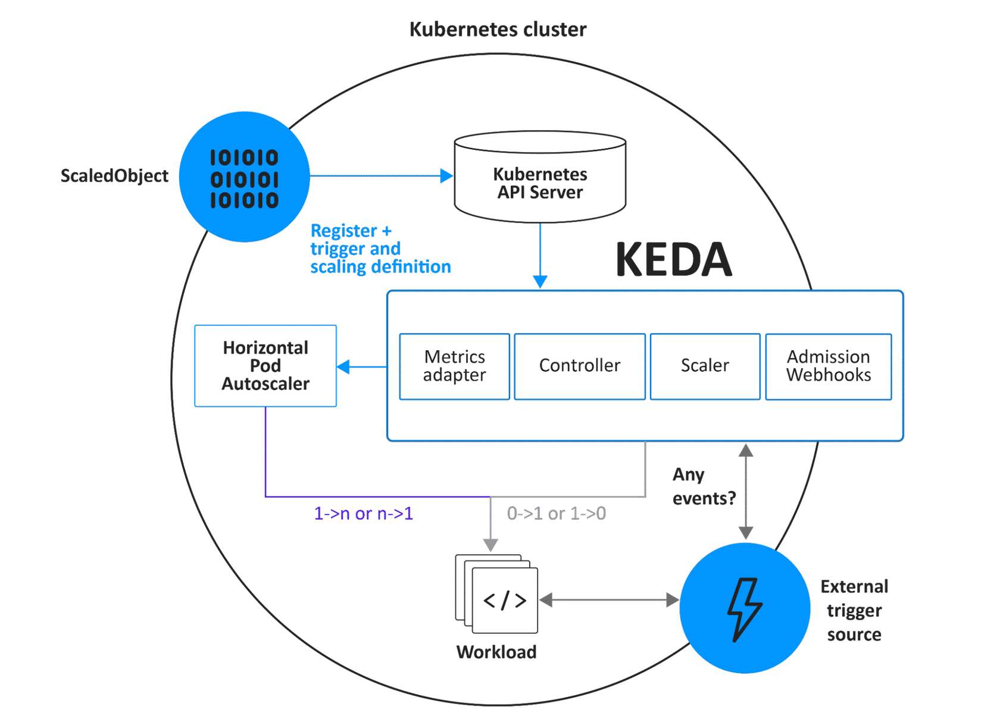

# Getting Started with KEDA

## Section and SCORM overview

The portal syllabus labels this section **Getting Started with KEDA**, with the source page **Key Components of KEDA**. The embedded module is titled **Chapter 3. Getting Started with KEDA**. Its cover says the chapter introduces KEDA's core components and how they work together for Kubernetes event-driven autoscaling. It previews KEDA architecture, custom resources, integration with HPA, and installing/removing KEDA using Helm.

### Internal screens

The SCORM table of contents lists these screens in order:

1. Chapter 3 Overview
2. How KEDA Works
3. Architecture of KEDA
4. KEDA Custom Resources (CRDs)
5. Setting Up and Removing KEDA

### Navigation and visual

The portal repeats the course navigation instructions: begin the lesson, use its menu, advance with the next-lesson control at the bottom of each page, and finish all content before using the gray next-section arrow. The cover repeats the KEDA/Kubernetes scaling illustration described below: KEDA and a Kubernetes symbol among clouds, opposite scaling arrows, and container-like forms.


## Chapter 3 Overview

This chapter gives an in-depth look at KEDA's core components and how they work together to provide event-driven autoscaling in Kubernetes. Learners should be able to discuss KEDA architecture, examine its key components and custom resources (CRDs), and deploy KEDA using Helm. The screen uses a pale cloud-sky banner behind the heading; no separate instructional diagram, video, or audio is exposed.


## How KEDA Works

KEDA is presented as a lightweight, single-purpose component that can be added to a Kubernetes cluster. It extends Kubernetes without replacing or duplicating existing components and works alongside tools such as the Horizontal Pod Autoscaler (HPA). Applications can be mapped directly to event-driven scaling while other workloads continue operating normally, allowing KEDA to work with different Kubernetes frameworks and applications.

The screen's three expandable role cards describe these responsibilities:

- **Agent:** KEDA enables deployments to scale to and from zero according to whether events are present. The `keda-operator` container manages workload scaling after KEDA is enabled on the cluster.
- **Metrics:** KEDA exposes external and event-based metrics, including stream lag and message-queue length, to HPA so HPA can scale workloads from them. In this role KEDA also acts as a Kubernetes metrics server; `keda-operator-metrics-apiserver` serves the metrics.
- **Admission Webhooks:** KEDA can work with admission controllers to monitor and respond to resource-configuration changes. This supports cluster stability and prevents multiple `ScaledObject` resources from controlling the same scaling target.

The screen closes by tying the roles together: KEDA monitors event sources, supplies scaling signals, and manages workload response as demand changes. The visual layout is a set of three vertically stacked expandable cards (Agent, Metrics, Admission Webhooks) beside the chapter progress/navigation panel. No video or audio is exposed on this screen.

## Architecture of KEDA

The introduction says KEDA integrates with Kubernetes HPA and works with external event sources and the `etcd` data store to read cluster events and scale workloads. The illustrated architecture is enclosed by a large circle labeled Kubernetes cluster. A ScaledObject connects through the Kubernetes API Server; a KEDA boundary contains the Metrics Adapter, Controller, Scaler, and Admission Webhooks. The HPA receives metric information from KEDA and adjusts the workload, while the Scaler monitors an external trigger source. The diagram labels the scaling direction as `1->n or n->1` and `0->1 or 1->0`, and asks “Any events?” alongside the event source. Blue arrows show the event/metric and control paths among these components. The caption credits the KEDA Architecture diagram as adapted from KEDA Documentation.

The diagram provides eight explanatory hotspots:

- **ScaledObject:** Defines how a target (for example, a Deployment, custom resource, Job, or StatefulSet) should be scaled and which event triggers KEDA monitors.
- **Horizontal Pod Autoscaler (HPA):** Uses KEDA-provided metrics to adjust the number of running pods to current demand.
- **Metrics Adapter:** Converts event signals into metrics and exposes them to HPA for real-time scaling decisions.
- **Controller:** Monitors `ScaledObject` resources, coordinates with scalers to process events, and initiates scaling decisions.
- **Scaler:** Monitors event sources and evaluates signals to determine when scaling should occur. Examples of supported source types named here include Redis, PostgreSQL, and cloud-based storage services.
- **Admission Webhooks:** Validate configuration changes and help prevent conflicting scaling definitions in the cluster.
- **Workload:** The application being scaled, such as a Deployment, Job, or StatefulSet.
- **External Event Source:** Supplies demand signals such as message queues, databases, or cloud services.



The screen's closing text describes the components as a continuous flow from event detection to workload scaling, extending Kubernetes autoscaling beyond traditional resource metrics to respond to real-time application demand. No video or audio is exposed on this screen.

## KEDA Custom Resources (CRDs)

The lesson explains that Kubernetes API resources let users create objects such as Pods, Deployments, and Jobs. Installing KEDA adds four Custom Resource Definitions (CRDs). The course says these API resources map event sources, enable authentication to access them, and support scaling targets such as Deployments, StatefulSets, Jobs, and other custom resources.

The first CRD presented is `scaledobjects.keda.sh`. A `ScaledObject` describes how KEDA should scale a workload, with these fields highlighted:

- `scaleTargetRef` identifies the Deployment or workload to scale.
- `triggers` names event sources and their trigger parameters.
- `minReplicaCount` and `maxReplicaCount` set the lower and upper replica counts.

The example shown is:

```yaml
apiVersion: keda.sh/v1alpha1
kind: ScaledObject
metadata:
  name: my-scaledobject
spec:
  scaleTargetRef:
    name: my-deployment
  triggers:
  - type: azure-queue
    metadata:
      queueName: my-queue
      connection: azure-secret
      queueLength: '5'
  minReplicaCount: 1
  maxReplicaCount: 10
```

The next CRD presented is `scaledjobs.keda.sh`. `ScaledJob` is described as a custom resource for autoscaling Kubernetes Jobs. Like `ScaledObject`, it specifies `scaleTargetRef` and `triggers`, with configuration specific to Jobs; it can also scale based on Job completion or failure events. The example shown is:

```yaml
apiVersion: keda.sh/v1alpha1
kind: ScaledJob
metadata:
  name: my-scaledjob
spec:
  scaleTargetRef:
    name: my-job
  triggers:
  - type: job-completion
```

The third CRD presented is `triggerauthentications.keda.sh`. `TriggerAuthentication` secures communication between KEDA and external event sources so only authenticated sources can trigger autoscaling. Its configuration supplies source credentials such as API keys and secrets. The example shown is:

```yaml
apiVersion: keda.sh/v1alpha1
kind: TriggerAuthentication
metadata:
  name: my-triggerauth
spec:
  secretTargetRef:
    - parameter: apiKey
      name: my-secret
      key: api-key
```

The fourth CRD is `clustertriggerauthentications.keda.sh`. `ClusterTriggerAuthentication` has similar authentication configuration to `TriggerAuthentication`, but applies at cluster scope so authentication details can be shared among multiple `ScaledObject` resources. The example shown is:

```yaml
apiVersion: keda.sh/v1alpha1
kind: ClusterTriggerAuthentication
metadata:
  name: my-cluster-triggerauth
spec:
  secretTargetRef:
    - parameter: apiKey
      name: my-secret
      key: api-key
```

The screen concludes that these resources collectively enable dynamic, event-driven autoscaling in a Kubernetes environment using KEDA.

The visual uses a pale cloud-sky banner behind the heading, blue subsection headings, and a bordered code panel with a copy icon. The visible portion has no separate architecture picture, video, or audio.

## Setting Up and Removing KEDA

The course notes three deployment options—Operator Hub, a YAML file, or a Helm chart—and focuses on Helm. The cluster must run Kubernetes 1.24 or later. The installation sequence shown is:

1. Add the KEDA Helm repository: `helm repo add kedacore https://kedacore.github.io/charts`
2. Update repository metadata: `helm repo update`
3. Install the chart and create the `keda` namespace: `helm install -i keda kedacore/keda --namespace keda --create-namespace`

The opening page uses a pale cloud-sky heading banner, a blue information callout for the Kubernetes version requirement, blue step headings, and bordered code panels with copy icons. No video or audio is exposed in this opening installation material.

The uninstall material instructs learners to remove created `ScaledObject` and `ScaledJob` resources, then uninstall the Helm chart. The resource cleanup command shown is:

```sh
kubectl delete $(kubectl get scaledobjects.keda.sh,scaledjobs.keda.sh -A \
  -o jsonpath='{"-n "}{.items[*].metadata.namespace}{" "}{.items[*].kind}{"/"}{.items[*].metadata.name}{"\n"}')
```

Then remove KEDA with:

```sh
helm uninstall keda -n keda
```

The chapter says Helm makes KEDA straightforward to install and remove with a small set of commands, so event-driven autoscaling can be integrated and managed as needed. Its final callout uses a rocket icon and says the learner has reached the end of the chapter and should use the gray arrow at the top right to move to the next chapter. The uninstall page continues the blue subsection/step headings and bordered code panels; the cleanup command panel has a horizontal scrollbar. No video or audio is exposed in this chapter.
