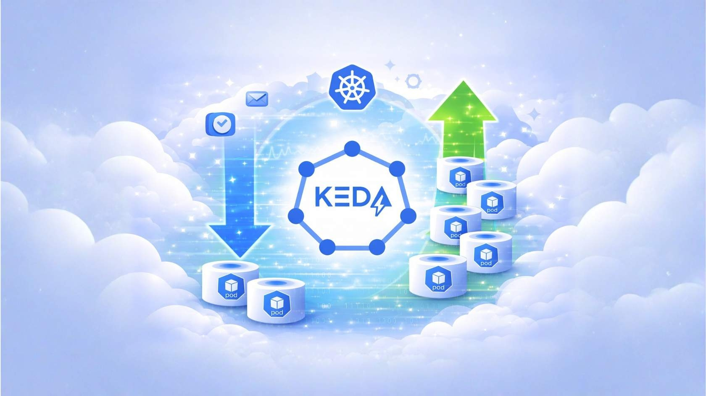
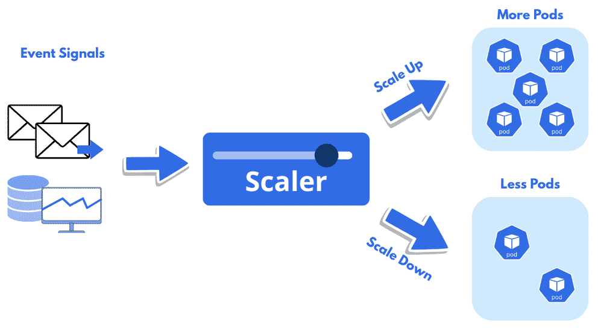

# Scalers Fundamentals

## Section and SCORM overview

The portal section is **Scalers Fundamentals**, with the source page **Event-Driven Scaling** and the internal page **Understanding Scalers**. The embedded module is titled **Chapter 4. Scalers Fundamentals**. Its cover says the chapter introduces KEDA scalers and explains how they enable Kubernetes event-driven autoscaling by monitoring external signals. It previews how scalers work, commonly used scalers and their use cases, and implementation best practices for cloud native environments.

### Internal screens

The SCORM table of contents lists these screens in order:

1. Chapter 4 Overview
2. What Are Scalers?
3. What Do KEDA Scalers Do?
4. Exploring Popular KEDA Scalers
5. Best Practices of KEDA

The portal repeats the course navigation instructions: begin the lesson, use its menu, advance with the next-lesson control at the bottom of each page, and finish all content before using the gray next-section arrow. The cover illustration has a blue title panel on the left and a pale cloudscape graphic on the right: a KEDA wordmark inside an outlined hexagon sits among cloud and Kubernetes imagery, with a large blue downward arrow and green upward arrow flanking small pod-like containers; small message/check-style symbols suggest event inputs.

## Chapter 4 Overview

Scalers are the KEDA components that enable event-driven autoscaling in Kubernetes. They monitor external signals and determine when workloads should scale up or down to match real-time demand. The chapter will explain how scalers work, their role in KEDA's architecture, how they connect event sources to scaling behavior, commonly used scalers and use cases, and effective implementation practices.

By the end, learners should be able to explain what scalers are and their role in KEDA, describe how they respond to events to drive scaling decisions, identify commonly used KEDA scalers and use cases, and implement KEDA best practices. The screen has a pale cloud-sky banner behind its heading and no separate diagram, video, or audio.

## What Are Scalers?

Kubernetes resource use changes over time; KEDA scalers help applications remain smooth and resource-efficient by reacting to external event signals and instructing Deployments to scale up or down. They continuously monitor incoming signals and trigger scaling actions according to predefined rules. The screen defines a scaler as evaluating incoming event signals and automatically adjusting the number of Pods based on demand.

The illustration shows email/message and database/metrics symbols labeled **Event Signals** flowing through blue arrows into a box labeled **Scaler**. Two outgoing branches show **Scale Up** to a cluster labeled **More Pods** and **Scale Down** to a cluster labeled **Less Pods**. It visualizes the scaler translating event input into a change in Pod count. No video or audio is exposed on this screen.

## What Do KEDA Scalers Do?

KEDA scalers are presented as more responsive and adaptable than traditional autoscalers because they respond to external events instead of relying only on internal metrics. They continuously evaluate external signals and guide how applications respond.

The three expandable behavior panels explain:

- **React to external events:** Unlike resource-based autoscalers, KEDA scalers use external event signals to trigger adjustments. Examples include message queues, databases, monitoring systems, and custom services.
- **Drive dynamic scaling:** Based on event data, a scaler chooses the response. The screen lists increasing or decreasing Deployment replicas, adjusting container resource limits, and pausing Deployments when demand falls.
- **Support customizable scaling strategies:** Users can define thresholds, scaling rules, and time windows for triggering actions so behavior can fit application needs.

The screen gives three examples: an HTTP scaler increases web-server replicas as request traffic rises; a Kafka-backed worker scaler responds to the number of pending queue messages to process a job backlog efficiently; and a database scaler monitors activity and adjusts resources as query volume increases to maintain performance. The visual presentation is three vertically stacked expandable panels with blue accent borders beside the chapter progress/navigation panel; no diagram, video, or audio is exposed here.

## Exploring Popular KEDA Scalers

The course states that, as of March 2026, the KEDA ecosystem has over 80 built-in and external scalers. It presents these eight common examples, each tied to a particular event source or metric:

| Scaler | Signal described in the course |
| --- | --- |
| HTTP | Number of active HTTP connections. |
| Azure Queue | Length of an Azure Queue. |
| Kafka | Topic metrics such as lag or the number of messages in a topic. |
| RabbitMQ | Number of messages in a RabbitMQ queue. |
| AWS CloudWatch | Metrics from AWS CloudWatch. |
| Prometheus | Queries to a Prometheus server. |
| MySQL | Queries to a MySQL database. |
| Cron | A Cron schedule for time-based scaling. |

The screen repeats the takeaway under each panel: every scaler monitors a specific signal and translates it into a scaling action. It says each scaler is implemented as a Kubernetes custom resource and defined in a Kubernetes manifest (YAML). For example, scaling a Deployment based on an Azure Service Bus queue length requires a `ScaledObject` that references the Azure Service Bus scaler; the scaler monitors the queue and adjusts the Pod count based on message count. The course concludes that KEDA's range of event sources and metrics lets developers and operations teams scale on real demand and optimize performance and resource use.

The visual is a stack of eight expandable scaler panels beside the navigation/progress column, followed by a pale blue lightbulb callout containing the repeated signal-to-action takeaway and explanatory text. No separate diagram, video, or audio is exposed on this screen.

## Best Practices of KEDA

The screen presents ten recommendations for configuring and operating KEDA:

1. **Understand the event source thoroughly.** Learn the source (for example, a message queue or database) well enough to configure KEDA for the correct metrics or events. Choose metrics that represent load and scaling need; for a queue, message count can be more relevant than age of the oldest message.
2. **Test scalability.** Performance-test the application at different loads before production to tune scaling parameters. Simulate event-source load to understand KEDA's response under different scenarios.
3. **Optimize scaling parameters.** Set cooldown periods to avoid frequent actions that can destabilize the system. Set reasonable thresholds and limits to avoid over-scaling (resource exhaustion) and under-scaling (poor performance).
4. **Manage resources effectively.** Set Pod resource requests and limits so autoscaling respects cluster capacity. When using HPA with KEDA, align HPA settings with the application's performance and availability needs.
5. **Consider security.** Secure access to event sources with RBAC and secrets management for credentials. Regularly audit and monitor source access and scaling activity for security issues.
6. **Use custom metrics where appropriate.** The expanded panel recommends custom scalers when built-in choices do not fit unique business logic, custom event sources, or application-critical metrics that KEDA's built-ins do not cover.
7. **Monitor and observe.** Collect autoscaling-process and event-source metrics to understand behavior over time, and enable detailed logs for troubleshooting and insight into scaling.
8. **Keep KEDA components updated.** Updates bring features, bug fixes, and security patches, help keep autoscaling efficient and secure, mitigate vulnerabilities, and maintain compatibility with the cloud native ecosystem.
9. **Use labels and annotations wisely.** These are key/value metadata on Kubernetes objects that help categorize, filter, and manage resources. Labels can group Pods or Services by environment, application version, or custom criteria; annotations attach non-identifying metadata.
10. **Engage with the community.** The course recommends using peer knowledge and support through discussion forums, community calls, documentation contribution/review, and online or in-person meetups.

The screen concludes that following these practices helps KEDA scale applications efficiently, reliably, and in line with real-world demand. The ten expandable recommendations appear as vertically stacked text panels with blue accent borders beside the navigation panel; the chapter-end callout includes a rocket icon and instructs learners to use the gray arrow at the top right to move to the next chapter. No video or separate instructional diagram is exposed.
